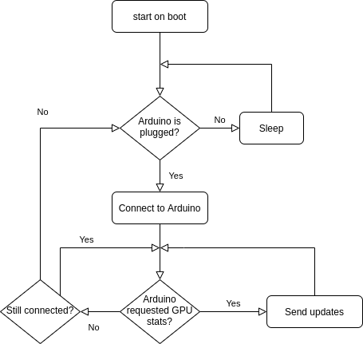

# Arduino GPU monitor

Monitor GPU usage stats from an ArduinoTFT display.

A USB connected Arduino requests GPU stats updates from a service script. The service script waits for a connection and send updates to Arduino when requested. See the logic below.



## Requirements

The service scripts are only working in Linux (tested with Ubuntu 20.04) and with Nvidia GPU and drivers.

------------------------------------------------

## Installation

### Arduino

Arduino code is in `src/arduino/tft-client`

Upload to Arduino Uno with 480x360 tft-display with [Arduino IDE](https://www.arduino.cc/en/software/). Install all required libraries for TFT such as Adafruit GFX and MCUFRIEND KBV. See more info [here](https://create.arduino.cc/projecthub/electropeak/ultimate-beginner-s-guide-to-run-tft-lcd-displays-by-arduino-081006).


### Serial port access rules

Using serial comms is by default restricted and needs sudo unless the port is given read/write permission for all users.

For single time permission (resets after restart). `/dev/ttyACM0` is the Arduino's port (check this).

```bash
sudo chmod 666 /dev/ttyACM0  
```

For persisting rule, create a new rule file

`sudo nano /etc/udev/rules.d/arduino-monitor.rules`

Add the following

`KERNEL=="ttyACM0", MODE="0666"`

This sets the world read and write permission to USB device. Active after computer restart.

### Script as a service

Install Pyhon env and required packages. cd into project root and: 

```bash
python3 -m venv venv
source venv/bin/activate
pip3 install --upgrade pip
pip3 install -r requirements.txt
```

If your Arduino port name is different from `/dev/ttyACM0`, change it in the /src/arduino_gpu_monitor/config.py

Check script paths in gpumonitor.service and copy to /etc/systemd/system/gpumonitor.service

```
sudo cp ./gpumonitor.service /etc/systemd/system/gpumonitor.service
```

Start service and enable it on boot.

```
sudo systemctl start gpumonitor.service
sudo systemctl enable gpumonitor.service
```
