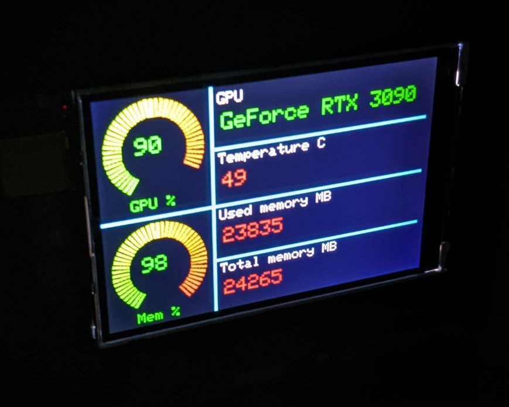

# Arduino GPU monitor

Monitor computer GPU status from an USB connected Arduino (with TFT display). I built this for monitoring my GPU temperature and utilization percentage when training AI models.



### Operation

A USB connected Arduino requests GPU status updates from a python service script. 

The service script waits for a USB connection and sends updates to Arduino when requested. See the logic below.


## Requirements

- The python service script works only in Linux (tested with Ubuntu 20.04).
- Nvidia GPU and CUDA driver
- Arduino Uno and TFT display (480x320)
- Python 3.6+

------------------------------------------------

## Installation

### Arduino

Arduino code is in `src/arduino/tft-client`

Upload to Arduino Uno with [Arduino IDE](https://www.arduino.cc/en/software/). Install all required libraries for TFT such as Adafruit GFX and MCUFRIEND KBV. See more info [here](https://create.arduino.cc/projecthub/electropeak/ultimate-beginner-s-guide-to-run-tft-lcd-displays-by-arduino-081006).

### Serial port access rules

Serial comms are restricted by default and need `sudo` priviledges unless the port is given read/write permission for all users.

**For single time permission** (resets after restart). 

`/dev/ttyACM0` is the Arduino's port (check this).

```bash
sudo chmod 666 /dev/ttyACM0  
```

**For persisting permission**, create a new rule file

`sudo nano /etc/udev/rules.d/arduino-monitor.rules`

Add the following

`KERNEL=="ttyACM0", MODE="0666"`

This sets the world read and write permission to USB device. Active after computer restart.

### Script as a service

Install Pyhon virtual env and required packages. cd into project root and: 

```bash
python3 -m venv venv
source venv/bin/activate
pip3 install --upgrade pip
pip3 install -r requirements.txt
```

If your Arduino port name is different from `/dev/ttyACM0`, change it from the `src/arduino_gpu_monitor/config.py`

Change `ExecStart` and `User` in **gpumonitor.service** to match your paths and username, and copy to `/etc/systemd/system/gpumonitor.service`

```
sudo cp ./gpumonitor.service /etc/systemd/system/gpumonitor.service
```

Start service and enable it on boot.

```
sudo systemctl start gpumonitor.service
sudo systemctl enable gpumonitor.service
```

Now, the script starts automatically on boot.